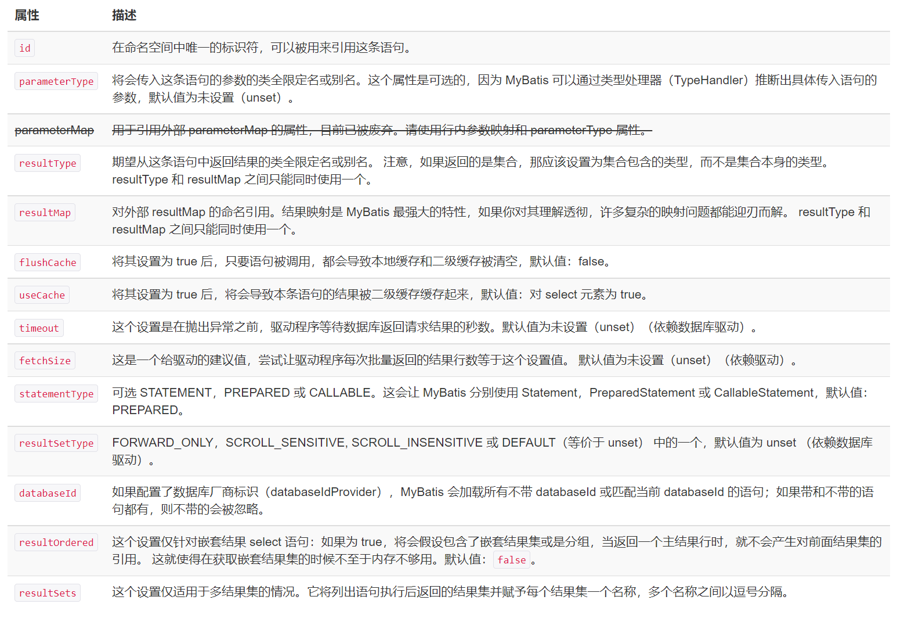
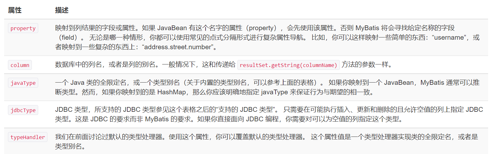
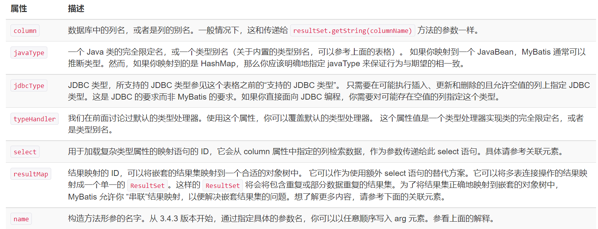
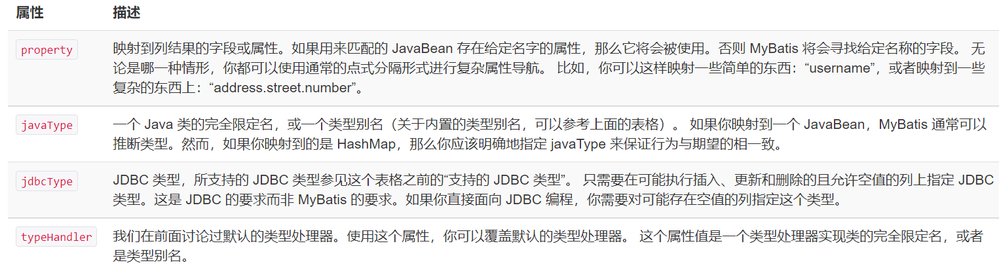
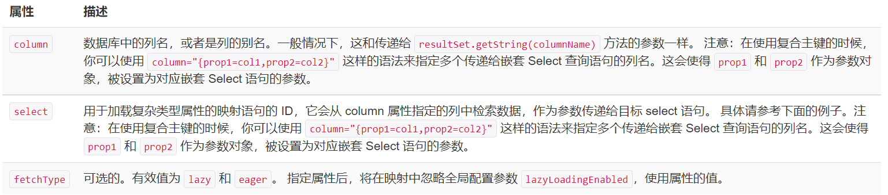

# XML映射器

顶级元素(按应该定义的顺序)

- `cache`- 该命名空间的缓存配置.
- `cache-ref`- 引用其他命名空间的缓存配置.
- `resultMap`- 描述如何从数据库结果集加载对象,**最复杂最强大**.
- `sql`- 可被其他语句引用的可重用语句块.
- `insert`- 映射插入语句
- `update`- 映射更新语句
- `delete`- 映射删除语句
- `select`- 映射查询语句

## select

例:

```xml
<select id="selectPerson" parameterType="int" resultType="hashmap">
  SELECT * FROM PERSON WHERE ID = #{id}
</select>
```

语句名:selectPerson, 接受 int 参数, 返回类型  hashmap




**insert,update**和**delete**与其相似

## sql

定义可重用的SQL代码片段,以便在其他语句使用.

```xml
<sql id="userColumns"> ${alias}.id,${alias}.username,${alias}.password </sql>
```

需要使用时,例

```xml
<select id="selectUsers" resultType="map">
  select
    <include refid="userColumns"><property name="alias" value="t1"/></include>,
    <include refid="userColumns"><property name="alias" value="t2"/></include>
  from some_table t1
    cross join some_table t2
</select>
```

## 参数

对于简单的场景,无需使用复杂的参数(parameterType),会自动设置为简单数据类型.

如果要传入复杂对象,例如 parameterType=“User” 

当使用`insert into users (id, username, password) values (#{id},#{username},#{password})`可以为其中参数指定特殊数据类型

例如`#{age,javaType=int,jdbcType=NUMERIC}`.

如果一个列允许使用null,且用到null时,必须指定 jdbcType.

### 字符串替换

当使用`#{}`,MyBatis默认创建`PreparedStatement`参数占位符.有时需要直接插入不转义字符串,使用`${}`.

当 SQL 语句中的元数据（如表名或列名）是动态生成的时候，字符串替换将会非常有用。 举个例子，如果你想 `select` 一个表任意一列的数据时，不需要这样写：

```java
@Select("select * from user where id = #{id}")
User findById(@Param("id") long id);

@Select("select * from user where name = #{name}")
User findByName(@Param("name") String name);

@Select("select * from user where email = #{email}")
User findByEmail(@Param("email") String email);

// 其它的 "findByXxx" 方法
```

而是可以只写这样一个方法：

```java
@Select("select * from user where ${column} = #{value}")
User findByColumn(@Param("column") String column, @Param("value") String value);
```

## 结果映射

例

```xml
<resultMap id="userResultMap" type="User">
  <id property="id" column="user_id" />
  <result property="username" column="user_name"/>
  <result property="password" column="hashed_password"/>
</resultMap>
```

property中是User 的属性,column为表中列名.

通过配置`resultMap`,可以直接使用如下

```xml
<select id="selectUsers" resultMap="userResultMap">
  select user_id, user_name, hashed_password
  from some_table
  where id = #{id}
</select>
```

### 高级结果映射

#### 结果映射（resultMap）

- `constructor` - 用于在实例化类时，注入结果到构造方法中
  - `idArg` - ID 参数；标记出作为 ID 的结果可以帮助提高整体性能
  - `arg` - 将被注入到构造方法的一个普通结果
- `id` – 一个 ID 结果；标记出作为 ID 的结果可以帮助提高整体性能
- `result` – 注入到字段或 JavaBean 属性的普通结果
- `association` – 一个复杂类型的关联；许多结果将包装成这种类型
  - 嵌套结果映射 – 关联可以是 `resultMap` 元素，或是对其它结果映射的引用
- `collection` – 一个复杂类型的集合
  - 嵌套结果映射 – 集合可以是 `resultMap` 元素，或是对其它结果映射的引用
- `discriminator` – 使用结果值来决定使用哪个`resultMap`
  - `case` – 基于某些值的结果映射
    - 嵌套结果映射 – `case` 也是一个结果映射，因此具有相同的结构和元素；或者引用其它的结果映射

##### id & result

```xml
<id property="id" column="post_id"/>
<result property="subject" column="post_subject"/>
```

`id`和`result`是结果映射的基础,将一个列的值映射到简单数据类型的属性或字段.

区别在于,id 对应的属性会被标记为对象标识符,在比较对象实例时使用,可以提高整体性能.

共有属性如下



##### 构造方法

如果要将结果注入构造方法,使用`constructor`元素.

```xml
<constructor>
   <idArg column="id" javaType="int" name="id" />
   <arg column="age" javaType="_int" name="age" />
   <arg column="username" javaType="String" name="username" />
</constructor>
```

如果存在名称和类型相同的属性,可以省略javaType.



##### 关联

```xml
<association property="author" column="blog_author_id" javaType="Author">
  <id property="id" column="author_id"/>
  <result property="username" column="author_username"/>
</association>
```

用于处理“has a”类型的关系.

关联的不同之处是，你需要告诉 MyBatis 如何加载关联。MyBatis 有两种不同的方式加载关联：

- 嵌套 Select 查询：通过执行另外一个 SQL 映射语句来加载期望的复杂类型。
- 嵌套结果映射：使用嵌套的结果映射来处理连接结果的重复子集。



###### 关联嵌套的Select查询



```xml
<resultMap id="blogResult" type="Blog">
  <association property="author" column="author_id" javaType="Author" select="selectAuthor"/>
</resultMap>

<select id="selectBlog" resultMap="blogResult">
  SELECT * FROM BLOG WHERE ID = #{id}
</select>

<select id="selectAuthor" resultType="Author">
  SELECT * FROM AUTHOR WHERE ID = #{id}
</select>
```

不适合用于大型数据集或大型数据表

###### 关联嵌套结果查询


```xml
<select id="selectBlog" resultMap="blogResult">
  select
    B.id            as blog_id,
    B.title         as blog_title,
    B.author_id     as blog_author_id,
    A.id            as author_id,
    A.username      as author_username,
    A.password      as author_password,
    A.email         as author_email,
    A.bio           as author_bio
  from Blog B left outer join Author A on B.author_id = A.id
  where B.id = #{id}
</select>
```

映射结果

```xml
<resultMap id="blogResult" type="Blog">
  <id property="id" column="blog_id" />
  <result property="title" column="blog_title"/>
  <association property="author" javaType="Author">
    <id property="id" column="author_id"/>
    <result property="username" column="author_username"/>
    <result property="password" column="author_password"/>
    <result property="email" column="author_email"/>
    <result property="bio" column="author_bio"/>
  </association>
</resultMap>
```

##### 集合

```xml
<collection property="posts" ofType="domain.blog.Post">
  <id property="id" column="post_id"/>
  <result property="subject" column="post_subject"/>
  <result property="body" column="post_body"/>
</collection>
```

和关联元素几乎一样.当要映射嵌套结果集合到List,可以使用集合元素.

###### 集合的嵌套Select查询

```xml
<resultMap id="blogResult" type="Blog">
  <collection property="posts" javaType="ArrayList" column="id" ofType="Post" select="selectPostsForBlog"/>
</resultMap>

<select id="selectBlog" resultMap="blogResult">
  SELECT * FROM BLOG WHERE ID = #{id}
</select>

<select id="selectPostsForBlog" resultType="Post">
  SELECT * FROM POST WHERE BLOG_ID = #{id}
</select>
```

`ofType`元素,将JavaBean属性的类型和集合存储的类型区分.

```xml
<collection property="posts" javaType="ArrayList" column="id" ofType="Post" select="selectPostsForBlog"/>
```

读作： “posts 是一个存储 Post 的 ArrayList 集合”

###### 集合的嵌套结果映射

```xml
<select id="selectBlog" resultMap="blogResult">
  select
  B.id as blog_id,
  B.title as blog_title,
  B.author_id as blog_author_id,
  P.id as post_id,
  P.subject as post_subject,
  P.body as post_body,
  from Blog B
  left outer join Post P on B.id = P.blog_id
  where B.id = #{id}
</select>
```

 要映射博客里面的文章集合：

```xml
<resultMap id="blogResult" type="Blog">
  <id property="id" column="blog_id" />
  <result property="title" column="blog_title"/>
  <collection property="posts" ofType="Post">
    <id property="id" column="post_id"/>
    <result property="subject" column="post_subject"/>
    <result property="body" column="post_body"/>
  </collection>
</resultMap>
```

##### 鉴别器

```xml
<discriminator javaType="int" column="draft">
  <case value="1" resultType="DraftPost"/>
</discriminator>
```

类似 Java中的switch语句,处理一个查询返回多个不同结果集.

一个鉴别器的定义需要指定 column 和 javaType 属性。column 指定了 MyBatis 查询被比较值的地方。 而 javaType 用来确保使用正确的相等测试.

```xml
<resultMap id="vehicleResult" type="Vehicle">
  <id property="id" column="id" />
  <result property="vin" column="vin"/>
  <result property="year" column="year"/>
  <result property="make" column="make"/>
  <result property="model" column="model"/>
  <result property="color" column="color"/>
  <discriminator javaType="int" column="vehicle_type">
    <case value="1" resultMap="carResult"/>
    <case value="2" resultMap="truckResult"/>
    <case value="3" resultMap="vanResult"/>
    <case value="4" resultMap="suvResult"/>
  </discriminator>
</resultMap>
```

如果 carResult 的声明如下：

```xml
<resultMap id="carResult" type="Car">
  <result property="doorCount" column="door_count" />
</resultMap>
```

那么只有 doorCount 属性会被加载。这是为了即使鉴别器的 case 之间都能分为完全独立的一组，尽管和父结果映射可能没有什么关系。在上面的例子中，我们当然知道 cars 和 vehicles 之间有关系，也就是 Car 是一个 Vehicle。因此，我们希望剩余的属性也能被加载。而这只需要一个小修改。

```xml
<resultMap id="carResult" type="Car" extends="vehicleResult">
  <result property="doorCount" column="door_count" />
</resultMap>
```

更简洁的写法

```xml
<resultMap id="vehicleResult" type="Vehicle">
  <id property="id" column="id" />
  <result property="vin" column="vin"/>
  <result property="year" column="year"/>
  <result property="make" column="make"/>
  <result property="model" column="model"/>
  <result property="color" column="color"/>
  <discriminator javaType="int" column="vehicle_type">
    <case value="1" resultType="carResult">
      <result property="doorCount" column="door_count" />
    </case>
    <case value="2" resultType="truckResult">
      <result property="boxSize" column="box_size" />
      <result property="extendedCab" column="extended_cab" />
    </case>
    <case value="3" resultType="vanResult">
      <result property="powerSlidingDoor" column="power_sliding_door" />
    </case>
    <case value="4" resultType="suvResult">
      <result property="allWheelDrive" column="all_wheel_drive" />
    </case>
  </discriminator>
</resultMap>
```

## 自动映射

对于每一个结果映射，在 ResultSet 出现的列，如果没有设置手动映射，将被自动映射。在自动映射处理完毕后，再处理手动映射。

```xml
<select id="selectUsers" resultMap="userResultMap">
  select
    user_id             as "id",
    user_name           as "userName",
    hashed_password
  from some_table
  where id = #{id}
</select>
<resultMap id="userResultMap" type="User">
  <result property="password" column="hashed_password"/>
</resultMap>
```

有三种自动映射等级：

- `NONE` - 禁用自动映射。仅对手动映射的属性进行映射。
- `PARTIAL` - 对除在内部定义了嵌套结果映射（也就是连接的属性）以外的属性进行映射
- `FULL` - 自动映射所有属性。

默认为`PARTIAL`.

## 缓存

默认情况只启用本地会话缓存,仅仅对一个会话数据缓存.启用全局二级缓存,添加`<cache/>`

效果:

- 映射语句文件中的所有 select 语句的结果将会被缓存。
- 映射语句文件中的所有 insert、update 和 delete 语句会刷新缓存。
- 缓存会使用最近最少使用算法（LRU, Least Recently Used）算法来清除不需要的缓存。
- 缓存不会定时进行刷新（也就是说，没有刷新间隔）。
- 缓存会保存列表或对象（无论查询方法返回哪种）的 1024 个引用。
- 缓存会被视为读/写缓存，这意味着获取到的对象并不是共享的，可以安全地被调用者修改，而不干扰其他调用者或线程所做的潜在修改。

