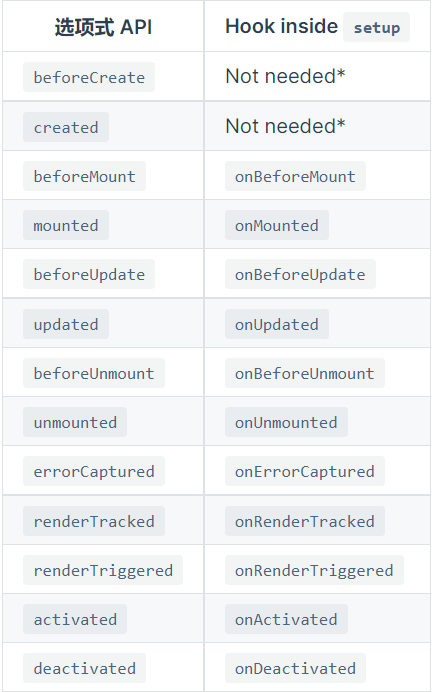

# Vue3

## setup

 Vue3中的新配置项，它的值是一个函数。

它是所有Composition API（组合API）“表演的舞台”。

`setup`的调用发生在 `data` property、`computed` property 或 `methods` 被解析之前，所以它们无法在 `setup` 中被获取。

组件中所用到的数据、方法等，都要配置在其中。

`setup`有两种返回值

- 一个对象，对象中属性、方法在模版中都可以直接使用。
- 一个渲染函数，可以自定义渲染内容。

```vue
<script>
	export default {
    name: "App",
    setup(){
      //数据
      let name = "Jack";
      let age = 18;
      
      //方法
      function sayHello(){
        console.log("Hello");
      }
      
      return {
        name,age,
        sayHello,
      }
    }
  }
</script>
```

> 尽量不要将setup与Vue2的配置进行混用。

## ref函数

直接添加入`setup`函数中的数据,Vue并不会进行响应式的数据代理.

需要使用到`ref`函数.

```Vue
<script>
    import {ref} from 'vue'
    export default {
        name: 'App',
        setup(){
            //data
            let name = ref("Jack");
            let age = ref(18);
            let job = ref({
                type:"1",
                salary:"2K",
            })
            
            //methods
            function changeInfo(){
                name.value = "Hans";//要使用data.value才能改变数据.
                job.value.type = "2";//对象中的数据不需要再次添加value.
            }
            return {
                name,age,changeInfo
            }
        }
    }
</script>
```


## 生命周期钩子

在Vue3中,依然可以使用Vue2的生命周期钩子.

只是Vue3删除了`destroy`,使用`unmount`作为代替.

在Vue3中,增加了组合式API,在`setup`中生命周期钩子有所不同,需要向其添加`on`作为前缀.



